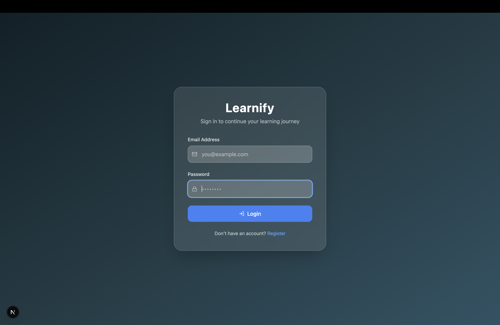
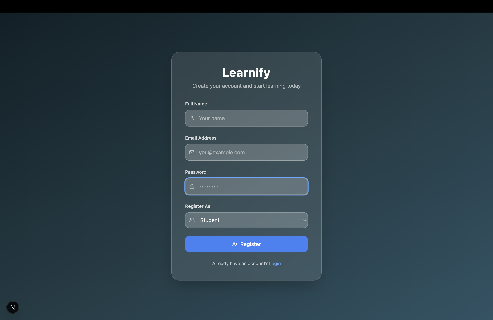
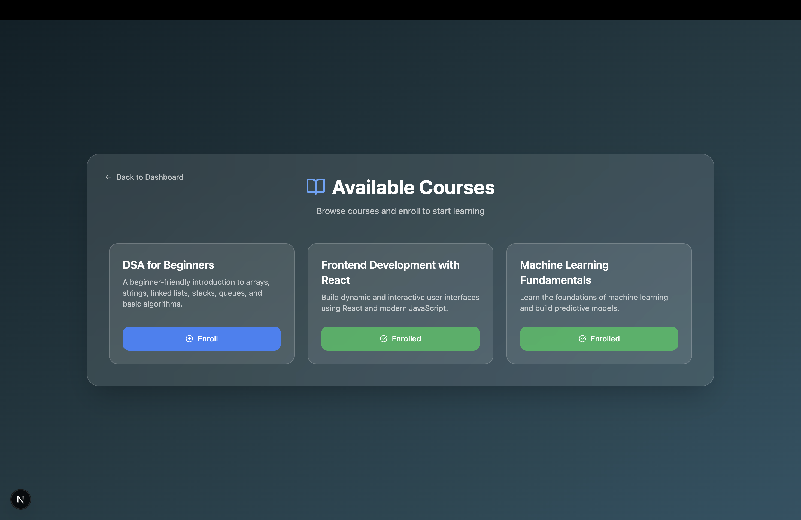
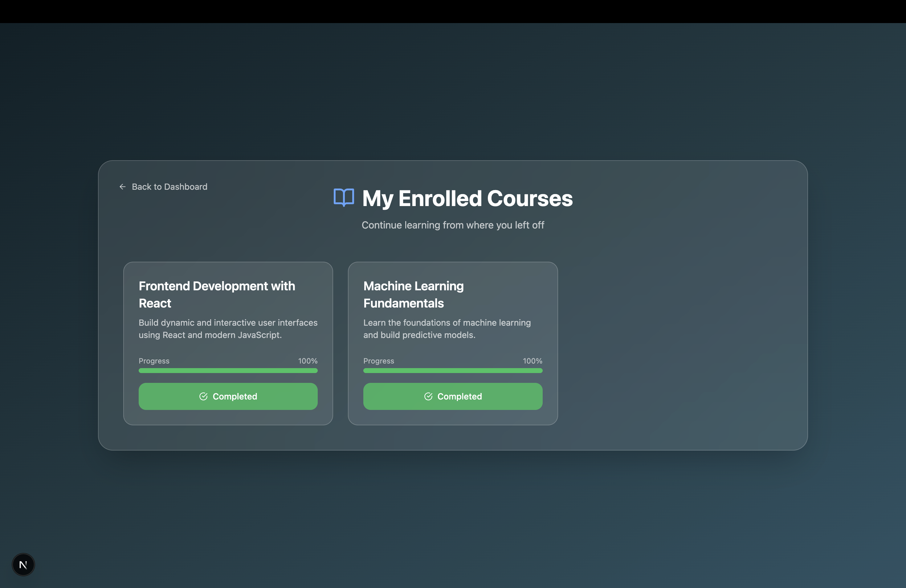
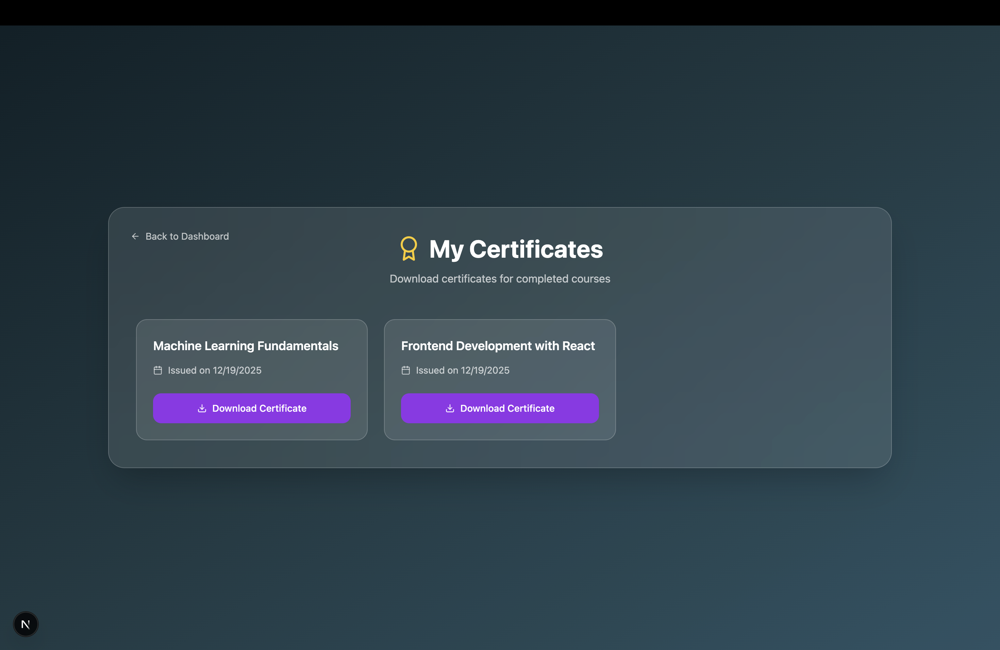
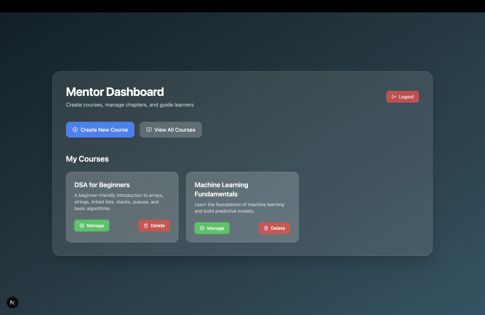
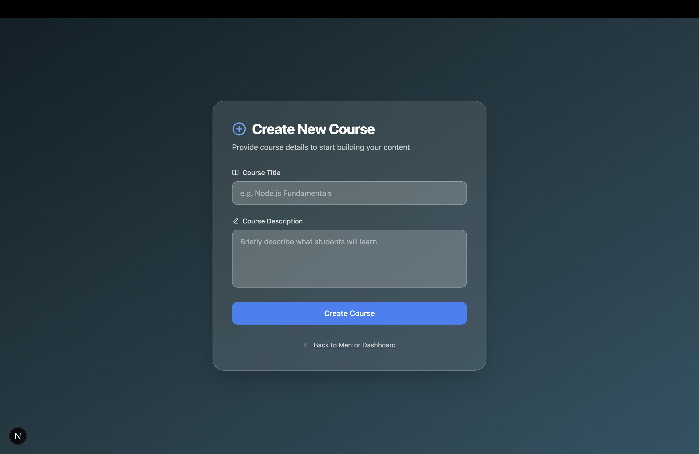
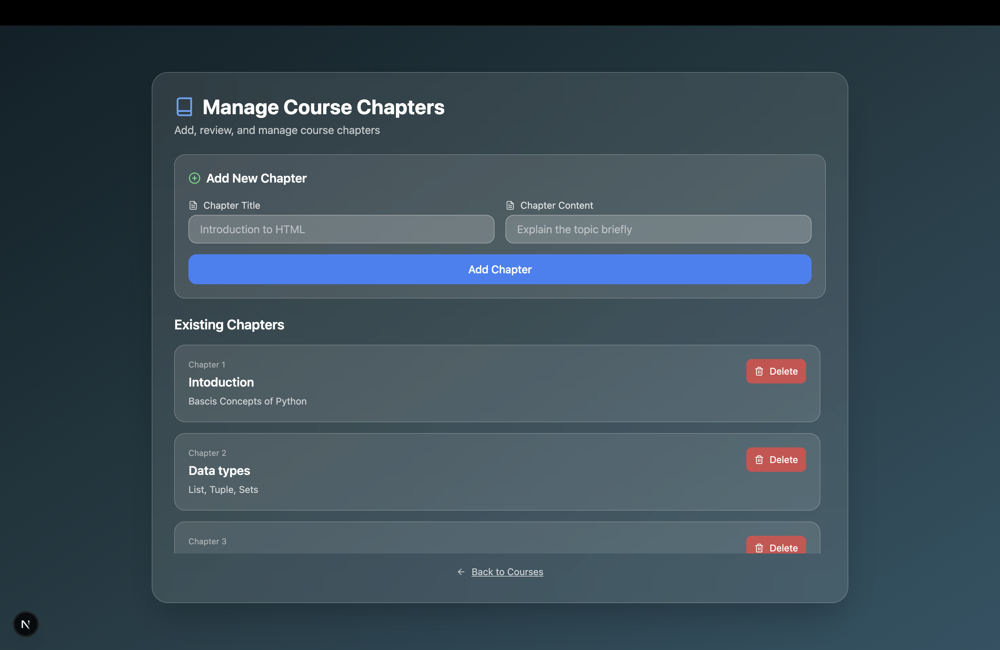
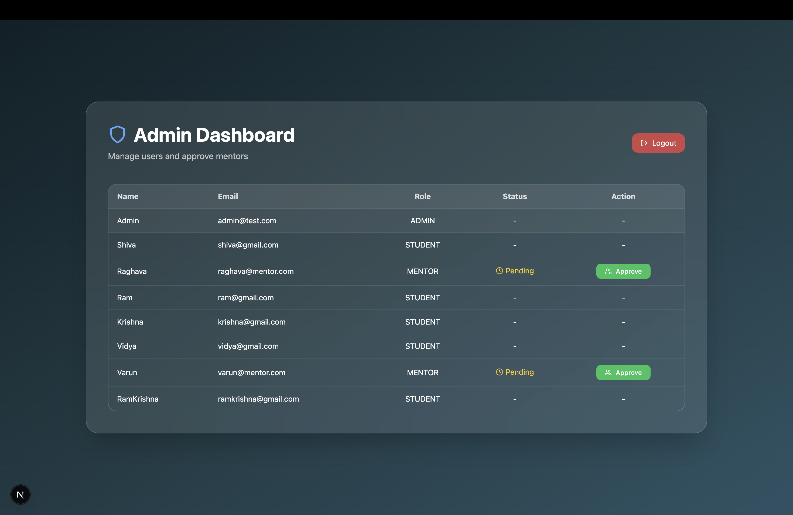

# Learnify – Learning Management System (LMS)

Learnify is a full-stack Learning Management System (LMS) designed to simulate real-world online learning platforms.  
It supports role-based access control (RBAC), sequential learning, progress tracking, and certificate generation.

This project focuses on **clean architecture, real business logic, and production-like behavior**, rather than just UI.

---

## 🚀 Features

### 👤 Authentication & Roles
- Student
- Mentor
- Admin
- Secure login & registration
- Role-based route protection (RBAC)

### 📚 Course Management
- Mentors can create and manage courses
- Add chapters to courses
- Delete and update content

### 🔒 Sequential Learning
- Chapters unlock sequentially
- Students must complete previous chapters to proceed
- Progress tracked per course

### 🎓 Certificates
- Certificates generated only after:
  - Enrollment
  - 100% course completion
  - All chapters completed
- Duplicate certificate generation is prevented
- Downloadable PDF certificates

### 📊 Dashboards
- **Student Dashboard**: progress, enrolled courses, certificates
- **Mentor Dashboard**: manage courses and chapters
- **Admin Dashboard**: approve mentors and manage users

---

## 🛠️ Tech Stack

### Frontend
- Next.js (App Router)
- TypeScript
- Tailwind CSS
- React Icons

### Backend
- Node.js
- Express.js
- TypeScript
- Prisma ORM

### Database
- **Supabase PostgreSQL**

### Tools
- Git & GitHub
- Postman (API testing)

---

## 🧠 Architecture Overview

The project follows a **modular and scalable architecture**.

### Backend Structure

## 📸 Screenshots

### 🔐 Login

### 📝 Registration

### 🎓 Student Dashboard

### 📚 Student Courses

### 📘 Enrolled Courses

### 🏆 Student Certificates

### 🧑‍🏫 Mentor Dashboard

### ➕ Mentor Create Course

### 🛠 Mentor Manage Course

### 🛡 Admin Dashboard

### 📄 Certificate PDF

